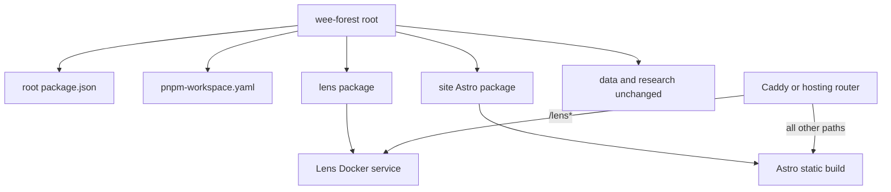

# Astro Monorepo Migration Plan

## Target Shape

Use a flat pnpm workspace rooted at [`/Users/mneveroff/Code/wee-forest`](file:///Users/mneveroff/Code/wee-forest), keeping the existing [`lens`](file:///Users/mneveroff/Code/wee-forest/lens) package where it is and adding a new [`site`](file:///Users/mneveroff/Code/wee-forest/site) Astro package. The Astro package should stay close to Astro defaults, with Tailwind as the styling layer.

The key production contract to preserve is in [`source/caddy/wee-forest.Caddyfile`](file:///Users/mneveroff/Downloads/wee-forest-astro-migration-handoff/source/caddy/wee-forest.Caddyfile): `/lens*` routes to `wee_forest_lens:3939`, while the root site currently routes to Ghost. Astro should replace Ghost with a landing page, not absorb Lens or recreate unused Ghost routes.

## Workspace Setup

- Add a private root [`package.json`](file:///Users/mneveroff/Code/wee-forest/package.json) with scripts such as `dev`, `dev:lens`, `dev:site`, `build`, `build:lens`, `build:site`, and `docker:build:lens` using `pnpm --filter`.
- Move the existing pnpm workspace config from [`lens/pnpm-workspace.yaml`](file:///Users/mneveroff/Code/wee-forest/lens/pnpm-workspace.yaml) to root and add `packages: ["lens", "site"]`, preserving current `overrides`, `minimumReleaseAge`, and `allowBuilds` settings.
- Consolidate dependency installation around a root [`pnpm-lock.yaml`](file:///Users/mneveroff/Code/wee-forest/pnpm-lock.yaml), with [`lens/package.json`](file:///Users/mneveroff/Code/wee-forest/lens/package.json) remaining the Lens package manifest.
- Remove package-manager drift by updating docs and automation that still assume package-local installs or npm, especially [`Dockerfile`](file:///Users/mneveroff/Code/wee-forest/Dockerfile), [`README.md`](file:///Users/mneveroff/Code/wee-forest/README.md), and [`docker-image.yml`](file:///Users/mneveroff/Code/wee-forest/.github/workflows/docker-image.yml).

## Astro Site Implementation

- Create [`site`](file:///Users/mneveroff/Code/wee-forest/site) as an Astro static site with TypeScript, `site: "https://weeforest.org"`, and Tailwind. Default to Astro's normal file layout and integrations instead of building a custom framework around the migration.
- Implement the landing page directly as `site/src/pages/index.astro`, using the Ghost `page.home` content as source material. Do not create Ghost-style post, tag, author, or catch-all route systems unless future content requires them.
- Add a small typed extraction/conversion script only if it speeds up pulling the home page HTML and settings from [`weeforest.ghost.2026-06-06-00-48-52.json`](file:///Users/mneveroff/Downloads/wee-forest-astro-migration-handoff/weeforest.ghost.2026-06-06-00-48-52.json). Otherwise, manually port the single landing page into Astro components and keep the script out of the runtime path.
- Copy needed images from [`source/ghost_wee_forest/ghost-data/content/images`](file:///Users/mneveroff/Downloads/wee-forest-astro-migration-handoff/source/ghost_wee_forest/ghost-data/content/images) into `site/public/content/images`.
- Recreate the intent of the Chapter Ghost theme from [`themes/chapter`](file:///Users/mneveroff/Downloads/wee-forest-astro-migration-handoff/source/ghost_wee_forest/ghost-data/content/themes/chapter), using Astro components and Tailwind rather than Handlebars. Prioritize the landing page, site shell, navigation, metadata, footer, fonts, and image styling; omit Ghost-only features like memberships/comments/newsletters and unused archive templates.

## Routes To Build

- `/` as the only migrated Ghost page, based on Ghost `page.home`.
- `/lens*` remains a deploy/proxy concern pointing at the existing Lens service.
- Optional sitemap output can include `/` and any intentional static links, but should not require preserving Ghost placeholder slugs.

## Build, Docker, And CI

- Update [`Dockerfile`](file:///Users/mneveroff/Code/wee-forest/Dockerfile) so the Lens image installs runtime dependencies with pnpm or a workspace-aware filtered install, instead of `npm install --production`.
- Update [`docker-image.yml`](file:///Users/mneveroff/Code/wee-forest/.github/workflows/docker-image.yml) to install from the repo root, cache the root lockfile, and run Lens build commands via `pnpm --filter wee-forest-lens`.
- Add a separate CI check or workflow step for `site`: install, typecheck, and `astro build`.
- Document deployment routing: static Astro output handles the domain root, while Caddy or the host routes `/lens*` to `wee_forest_lens:3939` and keeps the `www` to apex redirect.

## Verification

- Run root workspace install and filtered builds for both packages.
- Verify the Astro home page renders the migrated content and images.
- Verify canonical URLs, Open Graph/Twitter metadata, favicon/logo assets, and the generated static output for `/`.
- Verify `/lens/` still reaches the existing Lens app and is not shadowed by Astro.
- Produce a short migration note listing intentionally omitted Ghost routes/features and any theme behaviors that were simplified.